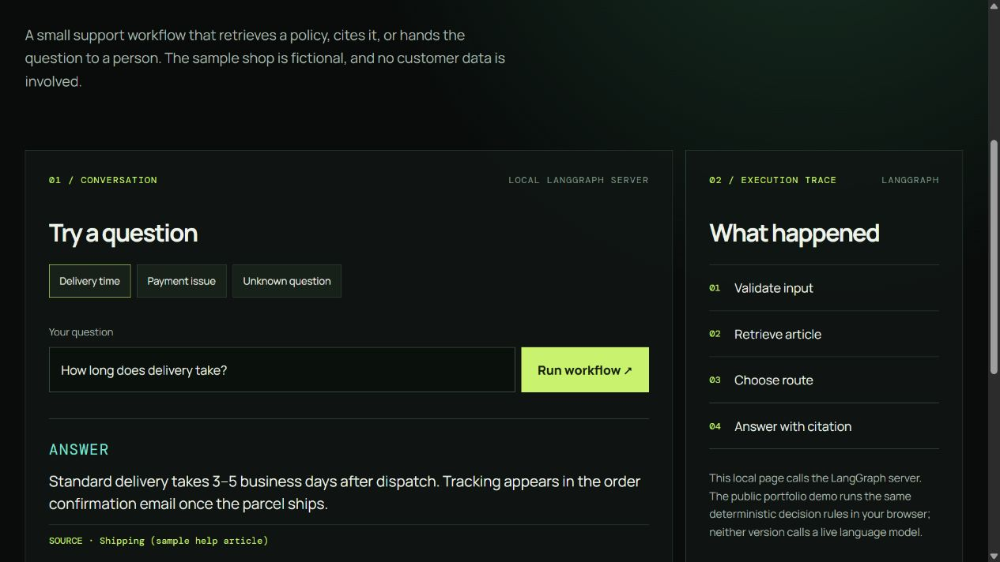

# Support Agent Lab

This is a small support triage project I can run and explain end to end. A question goes through input validation, help-article retrieval, and a LangGraph route: answer with a citation, hand off to a person, or abstain when the sample knowledge base has no evidence. The policies are fictional. There is no customer data and no real ticket system.

[Try the browser demo](https://om7203.github.io/om-vaghasiya-portfolio/lab/) · [Read the project case study](https://om7203.github.io/om-vaghasiya-portfolio/projects/support-agent.html)

The browser UI shows the answer, its source, and the path through the graph. The server exposes the same workflow at `POST /api/chat` and `GET /health`. I chose a deterministic answer step for this first version so the evaluation is repeatable and no API key is required. It does **not** use a live language model yet.



## Run it

Requires Node 20 or later.

```bash
npm ci
npm test
npm run eval
npm run langchain
npm start
```

Open `http://127.0.0.1:3000` and try “How long does delivery take?”, “My card was charged twice”, and “Do you sell bicycles?”. You can also call the API:

```bash
curl -X POST http://127.0.0.1:3000/api/chat -H "Content-Type: application/json" -d '{"question":"What is the warranty?"}'
```

## What to look at

- [Architecture](docs/ARCHITECTURE.md) shows the graph and the answer/handoff/abstain branches.
- [Evaluation cases](evals/cases.json) cover cited answers, human handoff, and unknown questions.
- [Results from a local run](docs/eval-results.json) show the outcome for each fixed case.
- [Tests](tests/engine.test.mjs) check the graph path, validation, and HTTP response.
- [LangChain retrieval exercise](examples/langchain-retrieval.mjs) composes the same validator and retriever as a small runnable chain; it does not use embeddings or a model.

This is a **production-minded prototype**, not a deployed customer-support service. Before real use it would need authentication, a maintained knowledge base, monitoring, rate limits, abuse handling, and an actual ticket integration. The next learning step is a LangChain retrieval experiment with embeddings, followed by a controlled LLM answer node. I would compare both against this deterministic baseline rather than claiming an improvement without evidence.
