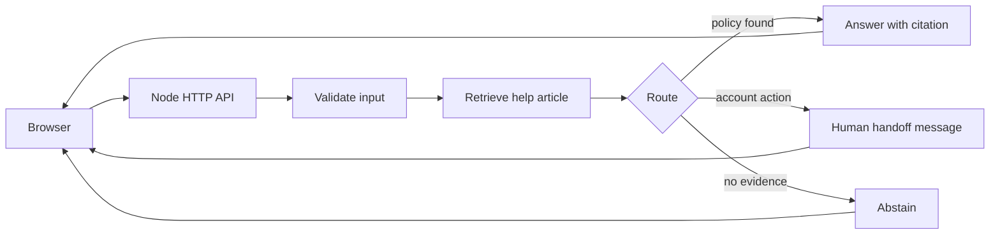

# Architecture

The public demo uses fictional shop policies. It never connects to customer records or creates a real ticket.



The server compiles a LangGraph `StateGraph` with explicit validation, retrieval, routing, and terminal nodes. Retrieval is token-based and deliberately small so every decision can be inspected. `trace` in each response shows the path taken. The graph is useful here for making branching and handoff behavior visible; it is not a substitute for the evaluation set.

The current demo is deterministic and does **not** call an LLM. This keeps it runnable without credentials and makes the refusal and citation behavior testable. A later version can add a language-model answer node behind the same evidence gate, plus persistent tickets and authentication. Those services would require separate privacy, security, and deployment work.

## API response

```json
{
  "route": "answer",
  "answer": "Standard delivery takes 3–5 business days after dispatch...",
  "citations": [{ "id": "shipping", "title": "Shipping", "url": "/kb/shipping" }],
  "confidence": "high",
  "trace": ["validate", "retrieve", "decide", "answer"]
}
```
