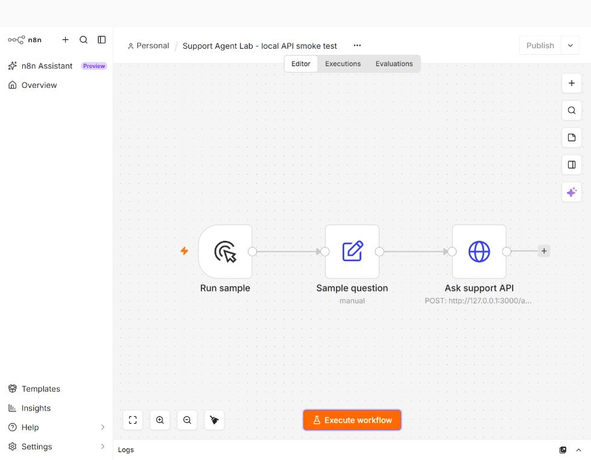
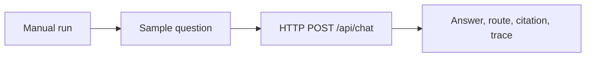

# n8n integration

The importable workflow is [`examples/n8n-support-api.workflow.json`](../examples/n8n-support-api.workflow.json). It is a small local smoke test: n8n passes a sample question to the Support Agent Lab API and displays the structured result. It does not add an LLM, send a message, or create a ticket.

## Run it

1. Start this project's server with `npm start` and confirm `http://127.0.0.1:3000/health` responds.
2. Import the workflow JSON into a local n8n instance running on the same machine. It uses no credentials.
3. Run the workflow. The final **Ask support API** node should return `route: answer`, a `shipping` citation, and `validate → retrieve → decide → answer` in `trace`.
4. Change **Sample question** to `My card was charged twice.` or `Do you sell bicycles?` to inspect the handoff and abstain paths.

The HTTP node points to `127.0.0.1:3000`, so a remote n8n instance or a Docker container cannot use it unchanged. Set the URL to an API address reachable from that instance. Do not expose this prototype API publicly without authentication and rate limits.

## Verified local run

I imported and executed the workflow with the n8n 2.41.3 CLI on September 29, 2026. All three nodes succeeded, and the HTTP node returned the [recorded result](n8n-result.json). The editor displayed the imported nodes, but its **Execute workflow** button did not start a run in this local installation. This checks n8n-to-API wiring through the CLI; it does not establish that the editor's run control works. The wider answer, handoff, and abstain behavior is covered by the project's tests and evaluation cases.

The CLI commands for a local n8n install are `n8n import:workflow --input=examples/n8n-support-api.workflow.json` and `n8n execute --id=support-agent-local-smoke-test --rawOutput`. The `id` in the JSON is intentionally stable for this example. Keep n8n's user data and any login credentials outside the public repository.
